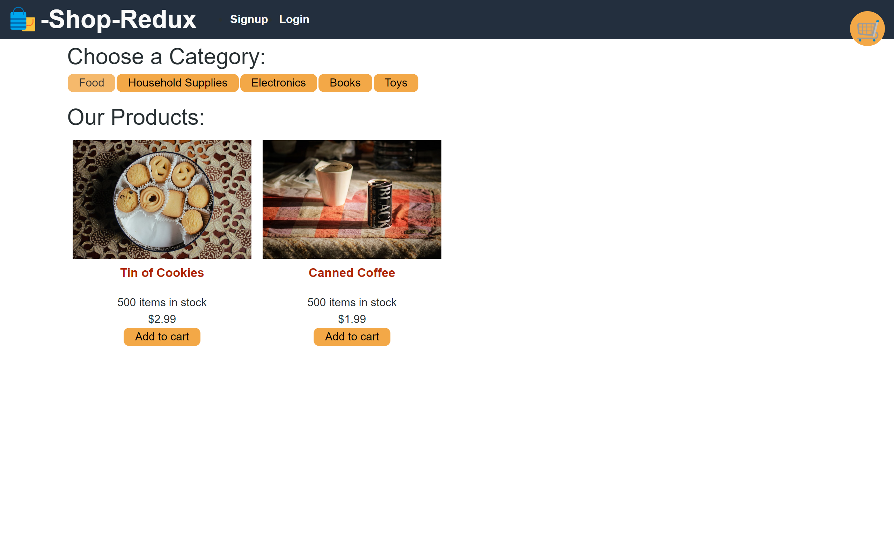
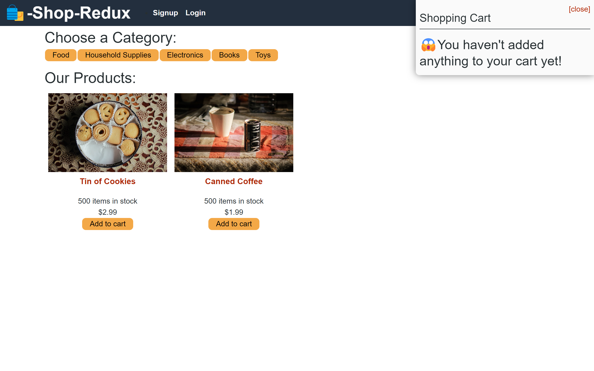
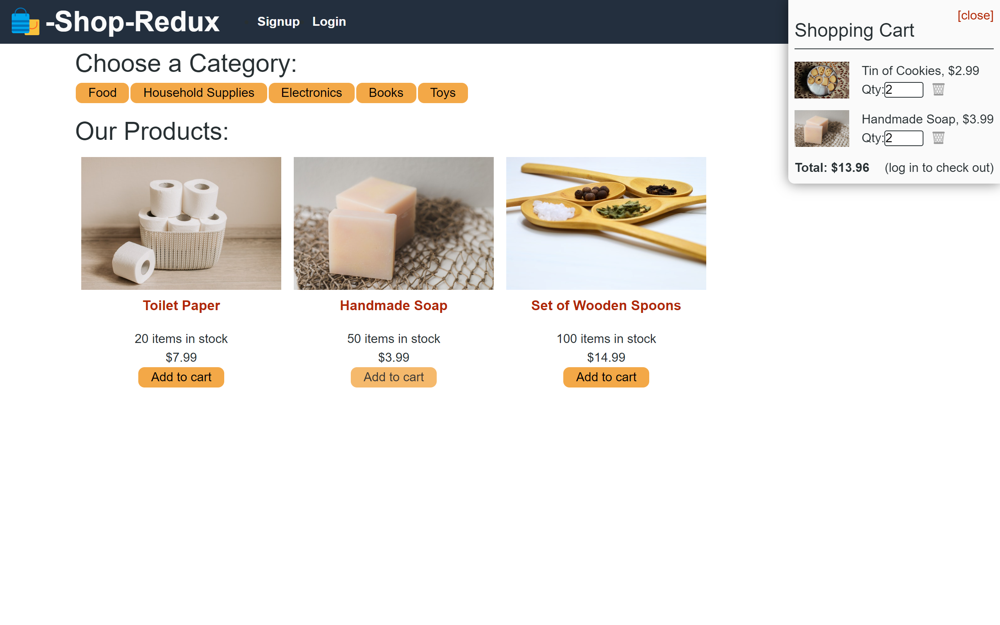
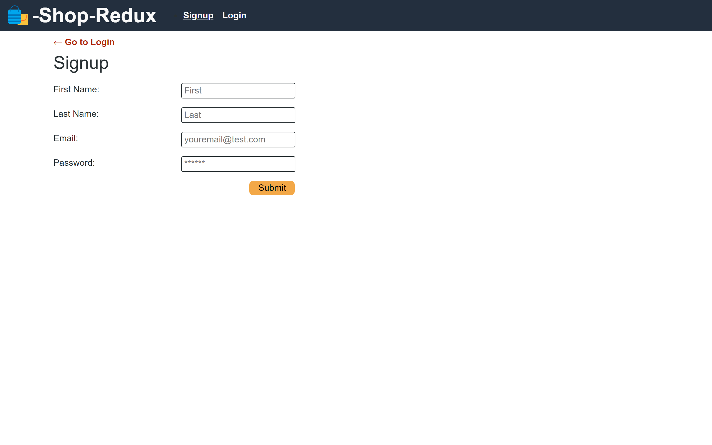
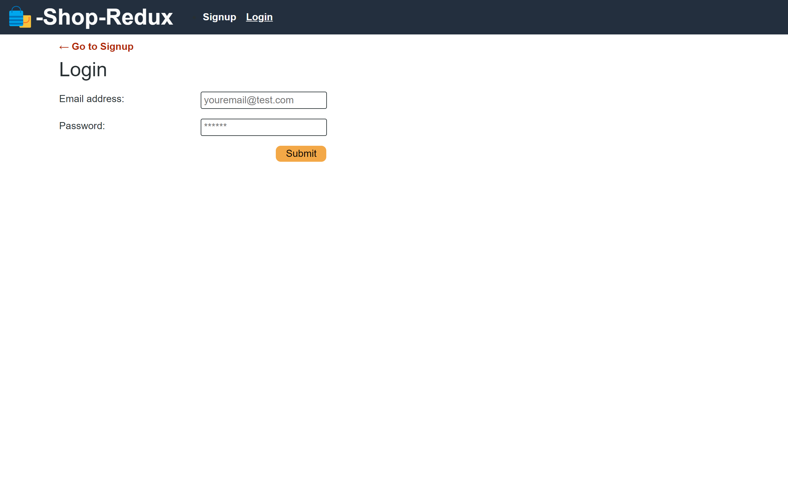
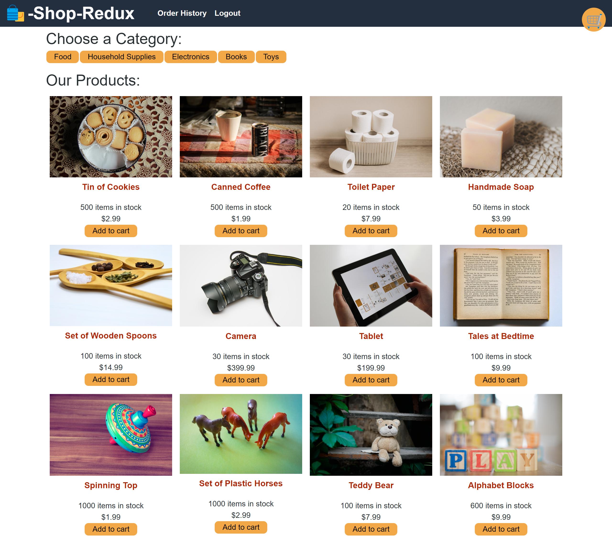
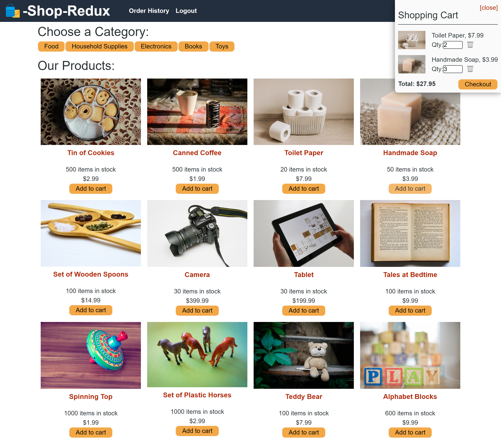
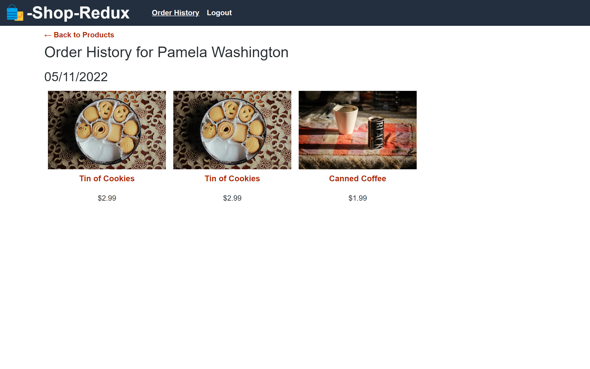

# Shop Redux App

This is a simple shopping app built with react-redux to process the user's actions in the app.

The repo contains both client and server folders.

## Summary

This simple shopping app offers the ability to browse products, add them to your cart, view your cart's items and total, view their order's history signup, login and checkout.

On the client side, user actions are handled by the react-redux package, with a reducers.js file handling state updates.

On the server side, users, products and categories are retrieved from the **shopredux** database. The cart is managed in the session and the order is saved and assigned to the logged in user when processed.

The application is seeded on start, with 2 sets of credentials that can be used to log in:

- email: pamela@testmail.com - password: password123 - This user has an order in their history.
- email: eholt@testmail.com - password: password123 - This user has no order history.

## Screenshots of the application

For a logged out user:

<details>
<summary>Desktop - Home page</summary>


</details>

<details>
<summary>Desktop - Filter by category</summary>



</details>

<details>
<summary>Desktop - Empty cart</summary>



</details>

<details>
<summary>Desktop - Cart with items</summary>



</details>

<details>
<summary>Desktop - Signup form</summary>



</details>

<details>
<summary>Desktop - Login form</summary>



</details>

For a logged in user:

<details>
<summary>Desktop - Home page</summary>



</details>

<details>
<summary>Desktop - Cart with items </summary>



</details>

<details>
<summary>Desktop - Order history </summary>



</details>

## Data structure

The MongoDB collections of documents are built as follow:

- **Category**
- **Product** - containing a category (reference to category ID)
- **Order** - containing an array of products (reference to product ID)
- **User** - containing an array of orders (as sub-collection)

## Technologies

Client side:
"@apollo/client": "^3.7.1",
"@reduxjs/toolkit": "^1.8.6",
"@stripe/stripe-js": "^1.42.1",
"@testing-library/jest-dom": "^5.16.5",
"@testing-library/react": "^13.4.0",
"@testing-library/user-event": "^13.5.0",
"graphql": "^16.6.0",
"jwt-decode": "^3.1.2",
"react": "^18.2.0",
"react-dom": "^18.2.0",
"react-redux": "^8.0.4",
"react-router-dom": "^6.4.3",
"react-scripts": "5.0.1",
"redux": "^4.2.0",

Server side:
"apollo-server": "^3.11.1",
"apollo-server-express": "^3.11.1",
"bcrypt": "^5.1.0",
"express": "^4.18.2",
"graphql": "^16.6.0",
"jsonwebtoken": "^8.5.1",
"mongoose": "^6.7.1",
"stripe": "^10.15.0"

## Installation

To get this project installed, the following steps are required:

Step 1 - Local Installation

Clone the repository, using SSH keys:

```
git clone git@github.com:Am0031/shop-redux.git
```

Or using HTTPS link:

```
git clone https://github.com/Am0031/shop-redux.git
```

Go into the new repository and open the app:

```
cd shop-redux
code .
```

Install all the required packages. This will install both client side and server side packages:

```
npm install
```

Once installed, to get this project running, the following steps must be followed:

Step 2 - Start the application

The database set up and seeding is triggered as part of the start instruction for the server part.

To open the server, open an integrated terminal at root level and enter the following command:

```
npm run start
```

This will display a confirmation message in the terminal, and your server is now running on port 3001.

To open the client's react app, open a second integrated terminal at client level and enter the following command:

```
npm run start
```

This will display a confirmation message in the terminal, and your react app is now running on port 3000 and will open in your browser and bring you to the home page.

Make sure to keep both terminals open for the app to work.

## Future developments

The app is not fully functional. There are still features to build and bugs to address:

- The checkout feature doesn't work at this stage. It is still WIP and needs integration with stripe.
- On the home page, there is no "All" button which would allow to clear the category filter. This needs to be added.
- On load of the page, the cart gets built showing each item in it twice. This needs to be resolved.
